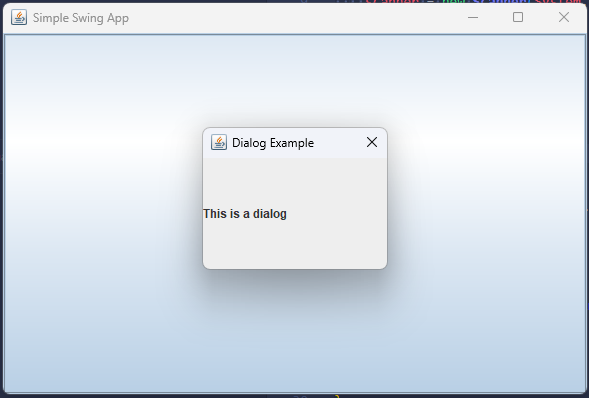
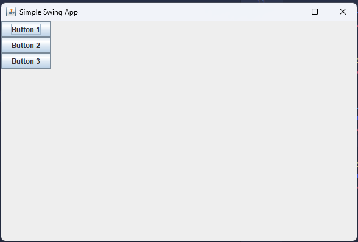
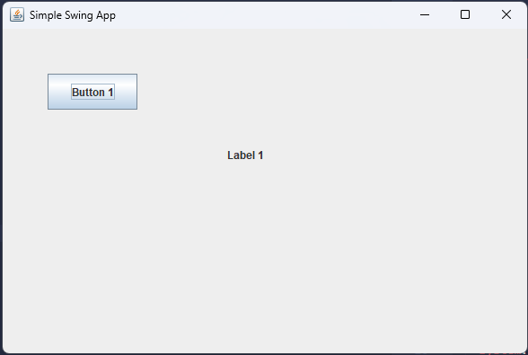
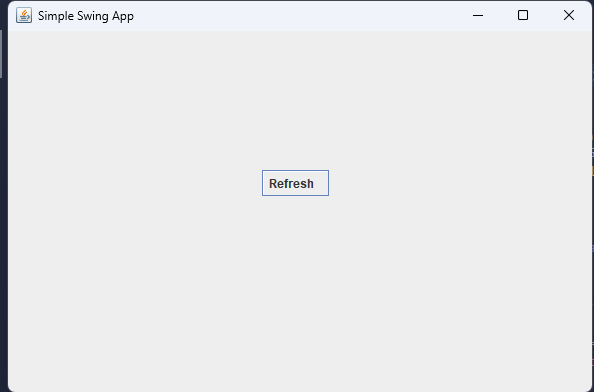
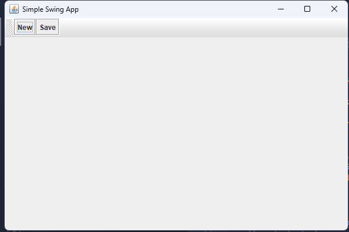

# Java Swing Cheat Sheet
## Table of Contents
- [Starter Template](#starter-template)
- [Core Window Components](#core-window-components)
  - [JPanel](#jpanel)
  - [JDialog](#jdialog)
  - [JOptionPane](#joptionpane)
- [Layout Managers](#layout-managers)
  - [Flow-Layout](#flow-layout)
  - [Border-Layout](#border-layout)
  - [Grid-Layout](#grid-layout)
  - [Box-Layout](#box-layout)
  - [Card-Layout](#card-layout)
  - [Null-Layout](#null-layout)
- [Basic UI Components](#basic-ui-components)
  - [JLabel](#jlabel)
  - [JButton](#jbutton)
  - [JTextField](#jtextfield)
  - [JPasswordField](#jpasswordfield)
  - [JTextArea](#jtextarea)
- [Selection Components](#selection-components)
  - [JCheckBox](#jcheckbox)
  - [JRadioButton--buttongroup](#jradiobutton--buttongroup)
  - [JComboBox](#jcombobox)
  - [JList](#jlist)
- [Containers](#containers)
  - [JTabbedPane](#jtabbedpane)
  - [JSplitPane](#jsplitpane)
  - [JDesktopPane--jinternalframe](#jdesktoppane--jinternalframe)
- [Menu--Toolbar](#menu--toolbar)
  - [JMenuBar--JMenu--JMenuItem](#jmenubar-jmenu-jmenuitem)
  - [JCheckBoxMenuItem](#jcheckboxmenuitem)
  - [JRadioButtonMenuItem](#jradiobuttonmenuitem)
  - [JPopupMenu](#jpopupmenu)
  - [JToolBar](#jtoolbar)
- [Dialogs](#dialogs)
  - [showMessageDialog](#joptionpaneshowmessagedialog)
  - [showConfirmDialog](#joptionpaneshowconfirmdialog)
  - [showInputDialog](#joptionpaneshowinputdialog)
  - [showOptionDialog](#joptionpaneshowoptiondialog)

## Starter Template
```
String appName = "Simple Swing App";
int width = 600;
int height = 400;

JFrame frame = new JFrame(appName);


// components add here


frame.setSize(width, height);
frame.setDefaultCloseOperation(JFrame.EXIT_ON_CLOSE);
frame.setVisible(true);
```
## Core Window Components

| Component   | Description                                                                 | Typical Use                     |
|-------------|-----------------------------------------------------------------------------|--------------------------------|
| `JFrame`    | A top-level window with a title bar, border, and window controls.           | Main application window        |
| `JPanel`    | A lightweight container to group other components.                         | Organizing layout and grouping |
| `JDialog`   | A secondary window that can be modal or non-modal.                         | Pop-up forms or custom dialogs |
| `JOptionPane` | A utility class to show standard dialogs for messages, inputs, or options. | Quick alerts, confirmations, inputs |

### JPanel
```
// Layout or position your components as needed before this
JPanel panel = new JPanel();
panel.add(new JButton("Click Me"));
frame.add(panel);
```


### JDialog
```
JButton button = new JButton("Open Dialog");
button.addActionListener(e -> {
  JDialog dialog = new JDialog(frame, "Dialog Example", true);
  dialog.setSize(200, 150);
  dialog.add(new JLabel("This is a dialog"));
  dialog.setLocationRelativeTo(frame); // Center on parent
  dialog.setVisible(true);
});
frame.add(button);
```


### JOptionPane
```
JButton button = new JButton("Click Me");
frame.getContentPane().add(button);

button.addActionListener(e -> {
  JOptionPane.showMessageDialog(frame, "Hello World", "Info", JOptionPane.INFORMATION_MESSAGE);
});
```

## Layout Managers

| Layout Manager | Description                                                               |
| -------------- | ------------------------------------------------------------------------- |
| `FlowLayout`     | Places components in a row, wrapping as needed, centered by default.      |
| `BorderLayout`   | Divides container into five regions: NORTH, SOUTH, EAST, WEST, CENTER.    |
| `GridLayout`     | Arranges components in a grid with equal cell sizes.                      |
| `BoxLayout`     | Arranges components either in a single row (X_AXIS) or column (Y_AXIS).   |
| `CardLayout`     | Stacks components like cards; only one is visible at a time.              |
| `GroupLayout`    | Allows grouping of components hierarchically for precise control.         |
| `null`    | No layout manager; components are positioned absolutely with coordinates. |

### Flow Layout

```
frame.setLayout(new FlowLayout());
frame.add(new JButton("Button 1"));
frame.add(new JButton("Button 2"));
```


### Border Layout

```
frame.setLayout(new BorderLayout());
frame.add(new JButton("North"), BorderLayout.NORTH);
frame.add(new JButton("South"), BorderLayout.SOUTH);
frame.add(new JButton("East"), BorderLayout.EAST);
frame.add(new JButton("West"), BorderLayout.WEST);
frame.add(new JButton("Center"), BorderLayout.CENTER);
```


### Grid Layout

```
frame.setLayout(new GridLayout(2, 2));
frame.add(new JButton("Button 1"));
frame.add(new JButton("Button 2"));
frame.add(new JButton("Button 3"));
frame.add(new JButton("Button 4"));
```


### Box Layout

```
frame.setLayout(new BoxLayout(frame.getContentPane(), BoxLayout.Y_AXIS));
frame.add(new JButton("Button 1"));
frame.add(new JButton("Button 2"));
frame.add(new JButton("Button 3"));
```



### Card Layout

```
CardLayout cardLayout = new CardLayout();
frame.setLayout(cardLayout);

JPanel card1 = new JPanel();
card1.add(new JLabel("Card 1"));
JButton button1 = new JButton("Go to Card 2");
button1.addActionListener(e -> {
  cardLayout.show(frame.getContentPane(), "Card2");
});
card1.add(button1);

JPanel card2 = new JPanel();
card2.add(new JLabel("Card 2"));
JButton button2 = new JButton("Go to Card 1");
button2.addActionListener(e -> {
  cardLayout.show(frame.getContentPane(), "Card1");
});
card2.add(button2);

frame.add(card1, "Card1");
frame.add(card2, "Card2");

cardLayout.show(frame.getContentPane(), "Card1");
```


### Null Layout

```
frame.setLayout(null);
JButton btn = new JButton("Button 1");
btn.setBounds(50, 50, 100, 40);
frame.add(btn);
JLabel label = new JLabel("Label 1");
label.setBounds(250, 120, 100, 40);
frame.add(label);
```



## Basic UI Components

| Component      | Description                                  | Typical Use                     |
|----------------|----------------------------------------------|--------------------------------|
| `JLabel`       | Displays static text or images               | Showing labels or icons        |
| `JButton`      | Clickable button                             | Triggering actions             |
| `JTextField`   | Single-line input field                      | User text input                |
| `JPasswordField` | Single-line password input (hidden chars)  | Secure text entry              |
| `JTextArea`    | Multi-line text input                        | Larger text entry              |
| `JScrollPane`  | Adds scrollbars around components            | Scrolling for text areas or panels |

### JLabel
```
JLabel label = new JLabel("Hello, Swing!");
frame.add(label);
```
For Image:
```
ImageIcon icon = new ImageIcon("path/to/image.png");
JLabel imageLabel = new JLabel(icon);
frame.add(imageLabel);
```

### JButton
```
JButton button = new JButton("Click Me");
frame.add(button);

button.addActionListener(e -> {
    System.out.println("Button clicked!");
});

```

### JTextField
```
JTextField textField = new JTextField(15);
frame.add(textField);

JButton btnGet = new JButton("Get Text");
frame.add(btnGet);

btnGet.addActionListener(e -> {
    String textValue = textField.getText();
    System.out.println("TextField Value: " + textValue);
});

```

### JPasswordField
```
JPasswordField passwordField = new JPasswordField(15);
frame.add(passwordField);

JButton btnPass = new JButton("Show Password");
frame.add(btnPass);

btnPass.addActionListener(e -> {
    String password = new String(passwordField.getPassword());
    System.out.println("Password: " + password);
});

```

### JTextArea
```
JTextArea textArea = new JTextArea(5, 20);
JScrollPane scrollPane = new JScrollPane(textArea);
frame.add(scrollPane);

JButton btnArea = new JButton("Get Text");
frame.add(btnArea);

btnArea.addActionListener(e -> {
    String areaValue = textArea.getText();
    System.out.println("TextArea Value: " + areaValue);
});
```

## Selection Components

| Component      | Description                                  | Typical Use                          |
|----------------|----------------------------------------------|-------------------------------------|
| `JCheckBox`    | Checkbox allowing multiple selections        | On/off options                      |
| `JRadioButton` | Radio button allowing single selection       | One choice from a group             |
| `ButtonGroup`  | Groups radio buttons to enforce single select | Used with radio buttons             |
| `JComboBox`    | Drop-down list                               | Selecting one item from a list      |
| `JList`        | Displays a list of items                     | Single or multiple item selection   |

### JCheckBox
```
JCheckBox checkBox = new JCheckBox("Enable Feature");
frame.add(checkBox);

JButton btnCheck = new JButton("Check Status");
frame.add(btnCheck);

btnCheck.addActionListener(e -> {
    boolean isChecked = checkBox.isSelected();
    System.out.println("Checkbox Selected: " + isChecked);
});
```
### JRadioButton & ButtonGroup
```
JRadioButton option1 = new JRadioButton("Option 1");
JRadioButton option2 = new JRadioButton("Option 2");
ButtonGroup group = new ButtonGroup();

group.add(option1);
group.add(option2);

frame.add(option1);
frame.add(option2);

JButton btnRadio = new JButton("Get Selection");
frame.add(btnRadio);

btnRadio.addActionListener(e -> {
    String selected = option1.isSelected() ? "Option 1" :
                      option2.isSelected() ? "Option 2" : "None";
    System.out.println("Selected Radio Button: " + selected);
});

```

### JComboBox

```
JComboBox<String> comboBox = new JComboBox<>(new String[] {"Apple", "Banana", "Cherry"});
frame.add(comboBox);

JButton btnCombo = new JButton("Get Selected");
frame.add(btnCombo);

btnCombo.addActionListener(e -> {
    String selectedItem = (String) comboBox.getSelectedItem();
    System.out.println("Selected Item: " + selectedItem);
});
```

### JList
```
String[] fruits = {"Apple", "Banana", "Cherry", "Mango"};
JList<String> list = new JList<>(fruits);
list.setSelectionMode(ListSelectionModel.MULTIPLE_INTERVAL_SELECTION);
JScrollPane listScroll = new JScrollPane(list);
frame.add(listScroll);

JButton btnList = new JButton("Get List Selection");
frame.add(btnList);

btnList.addActionListener(e -> {
    java.util.List<String> selectedValues = list.getSelectedValuesList();
    System.out.println("Selected Values: " + selectedValues);
});
```

## Containers

| Component       | Description                                                | Typical Use                                  |
|----------------|------------------------------------------------------------|----------------------------------------------|
| `JTabbedPane`  | Container with tabs for switching between panels           | Grouping different views in tabs             |
| `JSplitPane`   | Splits area into two resizable sections (horizontal/vertical) | Adjustable panels side by side or top-bottom |
| `JScrollPane`  | Adds scrollbars around another component                   | Scrolling for lists, tables, text areas      |
| `JDesktopPane` | Container for internal frames (multiple document interface) | MDI applications like IDEs                   |
| `JInternalFrame` | A frame that lives inside a `JDesktopPane`               | Child windows within parent window           |

### JTabbedPane
```
JTabbedPane tabbedPane = new JTabbedPane();

JPanel tab1 = new JPanel();
tab1.add(new JLabel("Content of Tab 1"));

JPanel tab2 = new JPanel();
tab2.add(new JLabel("Content of Tab 2"));

tabbedPane.addTab("Tab 1", tab1);
tabbedPane.addTab("Tab 2", tab2);

frame.add(tabbedPane);
```


### JSplitPane
```
JPanel leftPanel = new JPanel();
leftPanel.add(new JLabel("Left Panel"));

JPanel rightPanel = new JPanel();
rightPanel.add(new JLabel("Right Panel"));

JSplitPane splitPane = new JSplitPane(JSplitPane.HORIZONTAL_SPLIT, leftPanel, rightPanel);
splitPane.setDividerLocation(150);

frame.add(splitPane);
```

```
JPanel topPanel = new JPanel();
topPanel.add(new JLabel("Top Panel"));

JPanel bottomPanel = new JPanel();
bottomPanel.add(new JLabel("Bottom Panel"));

JSplitPane splitPaneVertical = new JSplitPane(JSplitPane.VERTICAL_SPLIT, topPanel, bottomPanel);
splitPaneVertical.setDividerLocation(150);

frame.add(splitPaneVertical);
```


### JDesktopPane & JInternalFrame
```
JDesktopPane desktopPane = new JDesktopPane();

JInternalFrame internalFrame = new JInternalFrame("Internal Window", true, true, true, true);
internalFrame.setSize(200, 150);
internalFrame.setVisible(true);

desktopPane.add(internalFrame);
frame.add(desktopPane);
```


## Menu & Toolbar

| Component     | Description                                  | Typical Use                         |
|---------------|----------------------------------------------|------------------------------------|
| `JMenuBar`    | Top-level container for menus                | Placed at top of JFrame            |
| `JMenu`       | Represents a menu (e.g., File, Edit)         | Groups related menu items          |
| `JMenuItem`   | A clickable item inside a menu               | Executes an action when selected   |
| `JCheckBoxMenuItem` | Menu item with a checkbox option       | Toggle settings in a menu          |
| `JRadioButtonMenuItem` | Radio-style option in menu          | Single selection within group      |
| `JPopupMenu`  | Right-click context menu                     | Contextual commands                |
| `JToolBar`    | Horizontal or vertical bar with buttons & tools | Quick access action buttons     |

### JMenuBar, JMenu & JMenuItem 
```
JMenuBar menuBar = new JMenuBar();

JMenu fileMenu = new JMenu("File");
JMenuItem exitItem = new JMenuItem("Exit");

exitItem.addActionListener(e -> {
    System.out.println("Exiting application...");
    frame.dispose(); // closes the window
});

fileMenu.add(exitItem);
menuBar.add(fileMenu);
frame.setJMenuBar(menuBar);

```


### JCheckboxMenuItem
```
JMenuBar menuBar = new JMenuBar();

JMenu viewMenu = new JMenu("View");
JCheckBoxMenuItem darkModeItem = new JCheckBoxMenuItem("Enable Dark Mode");

darkModeItem.addActionListener(e -> {
  boolean enabled = darkModeItem.isSelected();
  System.out.println("Dark Mode enabled: " + enabled);
});

viewMenu.add(darkModeItem);
menuBar.add(viewMenu);

frame.setJMenuBar(menuBar);
```

### JRadioButtonMenuItem
```
JMenuBar menuBar = new JMenuBar();
JMenu themeMenu = new JMenu("Theme");
ButtonGroup themeGroup = new ButtonGroup();

JRadioButtonMenuItem lightTheme = new JRadioButtonMenuItem("Light");
JRadioButtonMenuItem darkTheme = new JRadioButtonMenuItem("Dark");

themeGroup.add(lightTheme);
themeGroup.add(darkTheme);

lightTheme.setSelected(true); 

themeMenu.add(lightTheme);
themeMenu.add(darkTheme);
menuBar.add(themeMenu);
frame.setJMenuBar(menuBar);
```

### JPopupMenu
```
JPopupMenu popupMenu = new JPopupMenu();

JMenuItem refreshItem = new JMenuItem("Refresh");
popupMenu.add(refreshItem);

refreshItem.addActionListener(e -> {
    System.out.println("Refresh clicked");
});


frame.addMouseListener(new MouseAdapter() {
  public void mousePressed(MouseEvent e) {
    if (e.isPopupTrigger())
      popupMenu.show(e.getComponent(), e.getX(), e.getY());
  }

  public void mouseReleased(MouseEvent e) {
    if (e.isPopupTrigger())
      popupMenu.show(e.getComponent(), e.getX(), e.getY());
  }
});

```


### JToolBar
```
JToolBar toolBar = new JToolBar();

JButton newButton = new JButton("New");
JButton saveButton = new JButton("Save");

newButton.addActionListener(e -> System.out.println("New clicked"));
saveButton.addActionListener(e -> System.out.println("Save clicked"));

toolBar.add(newButton);
toolBar.add(saveButton);

frame.add(toolBar, BorderLayout.NORTH);
```


## Dialogs

| Method              | Description                                       |
| ------------------- | ------------------------------------------------- |
| `showMessageDialog` | Displays a simple message (info, warning, error). |
| `showConfirmDialog` | Asks the user to confirm (Yes/No, etc).           |
| `showInputDialog`   | Prompts the user to enter text or value.          |
| `showOptionDialog`  | Fully customizable dialog with custom buttons.    |

### JOptionPane.showMessageDialog
```
JOptionPane.showMessageDialog(frame, "Operation successful!", "Info", JOptionPane.INFORMATION_MESSAGE);
```

### JOptionPane.showConfirmDialog
```
int result = JOptionPane.showConfirmDialog(frame, "Are you sure?", "Confirm", JOptionPane.YES_NO_OPTION);
if (result == JOptionPane.YES_OPTION) {
    System.out.println("User clicked YES");
} else {
    System.out.println("User clicked NO");
}

```

### JOptionPane.showInputDialog
```
String input = JOptionPane.showInputDialog(frame, "Enter your name:");
System.out.println("User entered: " + input);
```

### JOptionPane.showOptionDialog
```
String[] options = {"Option A", "Option B", "Cancel"};
int choice = JOptionPane.showOptionDialog(
    frame,
    "Choose an option:",
    "Options",
    JOptionPane.DEFAULT_OPTION,
    JOptionPane.QUESTION_MESSAGE,
    null,
    options,
    options[0]
);
System.out.println("Selected index: " + choice);
```